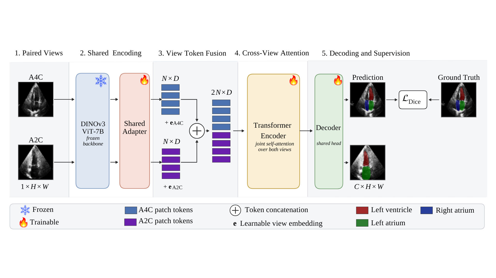
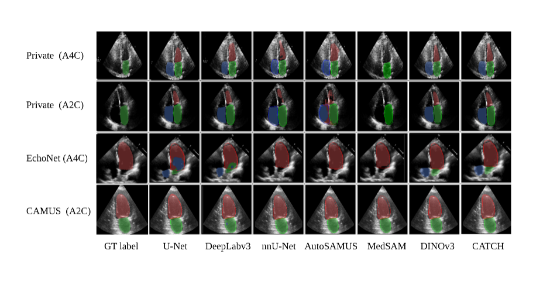

# CATCH: Cross-View Attention for Consistent Multi-Chamber Heart Segmentation

Official implementation of **"CATCH: Cross-View Attention for Consistent Multi-Chamber Heart Segmentation"** (MICCAI ASMUS 2026).

CATCH is a segmentation framework for the **left ventricle (LV)**, **left atrium (LA)**, and **right atrium (RA)** in 2D echocardiography. It pairs a **DINOv3** vision-transformer encoder (adapted for echo pretraining) with a **cross-view modeling module** that exchanges information across standard apical views, producing anatomically consistent chamber delineations rather than independent per-view predictions.

The model is trained on **~10,000 echocardiography studies** from a private multi-chamber dataset and evaluated on **~4,000 held-out studies**, plus **zero-shot** evaluation on the public **CAMUS** and **EchoNet-Dynamic** benchmarks.

<p align="center">
  
</p>

---

## Highlights

- **DINOv3 encoder for echo.** Self-supervised ViT backbone, modified for ultrasound-specific pretraining and dense feature extraction (see [`dinov3/`](dinov3/)).
- **Cross-view modeling module.** Attention across paired apical views enforces consistency of shared chambers, reducing view-dependent disagreement.
- **Three-chamber segmentation.** Joint LV / LA / RA prediction in a single forward pass.
- **Scale.** Trained on ~10k videos; validated on ~4k videos.
- **Zero-shot transfer.** Evaluated without fine-tuning on CAMUS and EchoNet-Dynamic.
- **Streaming data pipeline.** Unified loader over private and public corpora via [MosaicML Streaming](https://github.com/DeepRCL/rclstream).


## Repository structure

```
.
├── src/                     # Core implementation
│   ├── model.py             #   CATCH model, cross-view attention module, seg head
│   ├── datasets/            #   Private dataset + public datasets (CAMUS, EchoNet-Dynamic)
│   └── utils.py             #   Metrics, logging, checkpointing, visualization
│
├── scripts/                 # Entry points
│   ├── train_catch.py       #   Main training script
│   ├── train_ablations.sh   #   Ablation sweeps (encoder, cross-view module)
│   └── test_catch.sh        #   Evaluation on the private / zero-shot public datasets
│
├── dinov3/                  # DINOv3 (upstream code, modified for echo pretraining)
├── configs/                 # YAML configs for the echo-pretrained DINOv3
├── docs/
│   └── figures/             # Figures and result plots from the paper
└── requirements.txt
```

---

## Installation

```bash
git clone https://github.com/DeepRCL/CATCH.
cd CATCH

conda create -n catch python=3.10 -y
conda activate catch

# Install PyTorch matching your CUDA version (see https://pytorch.org)
pip install torch torchvision --index-url https://download.pytorch.org/whl/cu121

pip install -r requirements.txt
```

**Requirements:** Python ≥ 3.10, PyTorch ≥ 2.1, CUDA ≥ 12.1. Training was performed on `<N>` × `<GPU model>` GPUs.

### DINOv3 backbone weights

The encoder is initialized from DINOv3 weights. Download the official checkpoint from the
[DINOv3 repository](https://github.com/facebookresearch/dinov3), then point the config at it:

```yaml
# configs/model.yaml
model:
  config_file: ./configs/dinov3_vitb16_pretrain.yaml
  pretrained_weights: /path/to/dinov3_vitb16.pth
```

## Data

### Private dataset

The private multi-chamber echo dataset (~10k train / ~4k test videos, LV/LA/RA annotations) is not publicly available. 

### Public datasets (zero-shot evaluation)

| Dataset | Chambers | Source |
|---|---|---|
| CAMUS | LV, LA  | https://www.creatis.insa-lyon.fr/Challenge/camus/ |
| EchoNet-Dynamic | LV | https://echonet.github.io/dynamic/ |

Download each dataset from its official source (registration required), then add required files in data/camus_files:

---

## Training

```bash
run_name="train_catch"

python src/train.py \
    --epochs 10 \
    --dataset-name private_echo \
    --n-classes 4 \
    --batch-size 8 \
    --log-dir "outputs/${run_name}" \
    --use-attention \
    --run-name "${run_name}"
```
Training logs, checkpoints, and validation overlays are written to `--log-dir`.

---

## Evaluation

### Private test set & zero-shot on public benchmarks

```bash
python src/eval.py \
    --dataset-name private_echo \
    --n-classes 4 \
    --log-dir "outputs/${run_name}" \
    --use-attention \
    --start-ckpt "outputs/train_catch/ckpt_ep_1.pth" \
    --calc-ef
```

`--dataset-name` choices: `private_echo`, `camus`, `echonet`.

Reports per-chamber Dice, IoU, Hausdorff distance (95th percentile), and mean absolute error for ejection fraction, plus the **cross-view consistency** metric described in the paper.

No fine-tuning is performed; label spaces are mapped to the CATCH chamber classes at evaluation time.

---

## Ablations

Reproduce the ablation study from the paper:

```bash
python src/train.py \
    --epochs 10 \
    --dataset_name private_echo \
    --n_classes 4 \
    --batch_size 8 \
    --log-dir "outputs/${run_name}" \
    --use-attention \
    --run_name "${run_name}"
```

Covered axes:

| Ablation | Description |
|---|---|
| Cross-view module | Concatenation / single-view self-attention / late fusion |

To run a single variant, modify the command above:

- **Concatenation** — remove `--use-attention`
- **Single-view self-attention** — modify the dataset's required views
- **Late fusion** — add `--use-late-fusion`

---

## Results

Full quantitative tables are in the paper; qualitative figures and plots are in [`docs/results/`](docs/results/).

**Legend:** **bold** = best, *italic* = second best.
 
## Private test set — per-chamber segmentation
 
| Method | mDice LV ↑ | mDice LA ↑ | mDice RA ↑ | mIoU LV ↑ | mIoU LA ↑ | mIoU RA ↑ | HD95 LV ↓ | HD95 LA ↓ | HD95 RA ↓ |
|---|---|---|---|---|---|---|---|---|---|
| U-Net | 89.23 | 89.53 | 86.63 | 82.06 | 82.41 | 78.87 | 7.25 | 12.56 | 12.20 |
| DeepLabv3 | 85.52 | 87.62 | 84.03 | 75.68 | 80.23 | 75.10 | 9.54 | 10.82 | 13.49 |
| nnU-Net | *91.38* | 90.42 | *89.50* | **84.80** | 84.10 | *82.58* | *5.60* | 8.83 | 8.18 |
| AutoSAMUS | 85.01 | 80.79 | 78.97 | 75.29 | 71.76 | 68.81 | 13.73 | 15.13 | 19.66 |
| MedSAM | 90.62 | **92.73** | **90.25** | 83.33 | **86.69** | **82.89** | 5.81 | **4.73** | **5.57** |
| DINOv3 | 90.23 | 88.62 | 83.00 | 82.73 | 80.05 | 73.90 | 6.09 | 8.27 | 11.78 |
| **CATCH (ours)** | **91.49** | *91.04* | 89.20 | *84.69* | *84.19* | 81.57 | **5.11** | *5.79* | *6.80* |

---
## Zero-shot / external validation
 
| Method | CAMUS LV mDice ↑ | CAMUS LV mIoU ↑ | CAMUS LA mDice ↑ | CAMUS LA mIoU ↑ | EchoNet-Dynamic LV mDice ↑ | EchoNet-Dynamic LV mIoU ↑ |
|---|---|---|---|---|---|---|
| U-Net | 89.28 | 80.94 | 65.22 | 57.57 | 88.30 | 79.80 |
| DeepLabv3 | 91.36 | 84.33 | 79.02 | 69.63 | *90.41* | *82.99* |
| nnU-Net | 89.21 | 81.74 | 66.75 | 61.21 | 83.48 | 75.17 |
| AutoSAMUS | 86.41 | 76.97 | 79.05 | 69.70 | 84.59 | 75.00 |
| MedSAM | 89.79 | 81.74 | 75.33 | 66.30 | **90.91** | **83.63** |
| DINOv3 | *91.98* | *85.31* | *86.85* | *77.52* | 89.41 | 81.37 |
| **CATCH (ours)** | **92.97** | **87.00** | **88.22** | **79.52** | 89.64 | 81.60 |
 
---
<p align="center">
  
</p>

---

## Acknowledgements

This work builds on excellent open-source projects:

- **[DINOv3](https://github.com/facebookresearch/dinov3)** (Meta AI) — the encoder in `dinov3/` is derived from the official implementation and modified for echocardiography pretraining. Original license and copyright are retained in that directory.
- **[rclstream](https://github.com/DeepRCL/rclstream)** — used for the unified streaming data pipeline over the private and public datasets.
- The **[CAMUS](https://www.creatis.insa-lyon.fr/Challenge/camus/)** and **[EchoNet-Dynamic](https://echonet.github.io/dynamic/)** teams for releasing their datasets.

---
## AI Assistance

Portions of this project were developed with AI assistance:
- Code refactoring
- README documentation

---

## Citation

```bibtex
@inproceedings{catch2026,
  title     = {CATCH: Cross-View Attention for Consistent Multi-Chamber Heart Segmentation},
  author    = {Bassant Medhat, Nima Hashemi, Baraa Abdelsamad, Edward S. Chen\inst, Samira Sojoudi, Christina L. Luong, Teresa S. M. Tsang, Purang Abolmaesumi},
  booktitle = {MICCAI Workshop on Advances in Simplifying Medical UltraSound (ASMUS)},
  year      = {2026}
}
```

---

## Contact

Questions and issues: please open a GitHub issue or contact `bassant@ece.ubc.ca`.